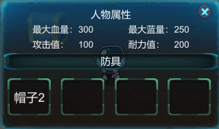

# 👾 太空逃生 Space Escape

> 项目地址：https://github.com/ZZZxm/Space-Escape

## 🎮 游戏背景

公元4096年，一批宇航员因宇宙飞船故障意外降临到了太空中一个神秘的星球，在这里他们不仅见识到了前所未有的奇异景色，也惊喜地发现这星球上居然存在着为数众多的生命。虽然这里绝大多数外星生命都是友好而胆怯的，仍有一些较为强大的生物自恃尖牙利爪，对遇见的宇航员不由分说地展开进攻。宇航员们一边维修飞船，一边探索着这片土地，同时抵抗不那么友善的外星居民，可渐渐地他们意识到，有什么事情开始不对劲了......这一切都像是一个永无休止的循环......

## ⚔️ 游戏类型
* 2D 
* Roguelike
## 💻 适用平台
* Windows
* MacOS

## 📤 开发环境

* Unity 2019.4.22

## 🎲 游戏玩法
* 玩家以0金币的起始状态开始冒险，尝试通过尽可能多的Journey
* 每轮Journey开始前，玩家可以选择使用角色（不同角色消耗金币不同）
* 一轮Journey共9个关卡，每个关卡有随机的获胜条件，玩家需达成条件方可进入下一关卡
* 每轮Journey的最后一关玩家将面临Boss关卡！
* 成功通关一轮Journey后，玩家将获得奖励，并可以选择新的角色开始新一轮Journey
* 游戏中玩家可以使用各种道具帮助通关冒险，击败敌人或开启宝箱将随机获得金币和道具
* 在冒险中积累金币，在无尽的Journey中冒险吧！

## 🕹️ 操作说明
| Keyboard/Mouse | Game |
| -------- | ------- |
|   <kbd>↑</kbd>/<kbd>W</kbd> | 上 |
|   <kbd>↓</kbd>/<kbd>S</kbd> | 下 |
|   <kbd>←</kbd>/<kbd>A</kbd> | 左   |
|   <kbd>→</kbd>/<kbd>D</kbd> | 右 |
| 鼠标右键| 攻击|
|   <kbd>Q</kbd>     | 技能1    |
|   <kbd>E</kbd>     | 技能2     |
|   <kbd>SPACE</kbd>     | 闪避 |


Player1太空武士：

|Attack| Effect|
|---|---|
|普通攻击 |一刀扣去敌人200点血量|
|技能Q|攻击2秒内攻击力倍增|
|技能E|1秒内速度倍增|

Player2太空射手:

|Attack| Effect|
|---|---|
|普通攻击 |向面前发射普通子弹|
|技能Q|向面前发射加大子弹，可以直接打死一个小怪|
|技能E|向面前110&deg;方向内发射12颗子弹|

Player3太空炸弹人：

|Attack| Effect|
|---|---|
|普通攻击 |范围为1的十字形炸弹 有1.5秒的冷却时间|
|技能Q|增加攻击范围为3|
|技能E|2秒内消除冷却时间限制|


## ✔️ 功能实现

- [x] 支持无限游玩机制（玩家可挑战无限关卡，敌人将逐渐增强）
- [x] 支持背包系统（玩家可切换装备）
- [x] 支持道具系统（回血道具、回蓝道具、加速道具、加防道具）
- [x] 支持四种随机关卡模式（击败所有敌人、幸存模式、宝箱模式、Boss战）
- [x] 支持三种人物选择（近战、射击、炸弹）
- [x] 支持三种敌人（Flying Monster, Green Monster, Boss）
- [x] 支持敌人自动追踪玩家
- [x] 支持四种敌人生成机制（根据随机关卡而改变）
- [x] 支持随机地图生成（地图形状、障碍物、陷阱等）

## 📘 游戏设计
### 整体流程设计


#### 变量流程设计
**全局变量设计**


**回合变量设计**


**关卡变量设计**


### 玩家设计

玩家均包含生命值、技能值、耐力值、攻击值、速度等属性，能够通过使用道具对上述属性进行修改。

玩家均包含方向控制、攻击、闪避操作，其中闪避操作的实现是通过协程控制参数使得玩家在一段时间内向反方向移动，并在该段时间内减免一半的伤害。
#### Player1近战砍刀


| 攻击 | 效果 |
|---|---|
|普通攻击 |一刀扣去敌人200点血量|
|技能Q|攻击2秒内攻击力倍增|
|技能E|1秒内速度倍增|


|属性|设置|
|---|---|
|生命值|初始值500|
|技能值|初始值200，技能Q消耗3点蓝，技能E消耗5点蓝|
|速度|初始值10|

玩家攻击效果通过在动画关键帧中增加动画事件来实现，设置子`Gameobject`使用`polygon collider 2D`对武士挥刀动画的刀面进行勾勒，事件触发时设置该`component`在动画播放时间内有效，利用`OnTriggerEnter2D`方法判断敌人是否与刀面相交，假设为敌人则对敌人造成相应的伤害。

#### Player2远程射击


|攻击| 效果|
|---|---|
|普通攻击 |发射小子弹，攻击力为100|
|技能Q|发射大子弹，怪物直接死亡|
|技能E|发射多方向子弹|

|属性|设置|
|---|---|
|生命值|初始值300|
|技能值|初始值250，技能Q消耗3点蓝，技能E消耗5点蓝|
|速度|初始值10|

#### Player3炸弹人


|攻击| 效果|
|---|---|
|普通攻击 |范围为1的十字形无差别攻击炸弹，攻击力为50，有1.5秒的冷却时间|
|技能Q|增加攻击范围为3|
|技能E|2秒内消除冷却时间限制|

|属性|设置|
|---|---|
|生命值|初始值400|
|技能值|初始值150，技能Q消耗5点蓝，技能E消耗3点蓝|
|速度|初始值10|

玩家攻击效果需要首先制作炸弹(Bomb)和爆炸效果(Explode)的`Prefab`,玩家触发攻击之后，`Instantiate`一个 Bomb 的`Prefab`，位置设置在一格 tilemap 上，通过 Bomb 的脚本利用协程在1s后向当前位置以及四周`Instantiate`爆炸效果(Explode)并且销毁 Bomb 对象，最后爆炸效果(Explode)动画播放完毕后，最后一帧设置动画事件对爆炸效果(Explode)进行销毁。对于炸弹攻击的判断通过`OnTriggerEnter2D`实现。

### 敌人设计

#### 敌人种类

游戏共设计3种敌人，分别为Flying Monster, Green Monster, Boss，具体设计如下。每种敌人都会随着通关回合数的增加而逐渐变强，从而提高后续闯关难度。

敌人被击败后，将随机掉落金币或道具。其中金币掉落的概率为70%，道具掉落的概率为30%，各道具掉落概率相同。

1. Flying Monster

   | 属性     | 详细数据                        |
   | -------- | ------------------------------- |
   | 血量     | 500（通关回合数+1则血量提高50） |
   | 攻击力   | 50（通关回合数+1则攻击提高5）   |
   | 防御力   | 20（通关回合数+1则防御提高3）   |
   | 攻击范围 | 40.0f                           |

2. Green Monster

   | 属性     | 详细数据                        |
   | -------- | ------------------------------- |
   | 血量     | 600（通关回合数+1则血量提高60） |
   | 攻击力   | 40（通关回合数+1则攻击提高7）   |
   | 防御力   | 30（通关回合数+1则防御提高3）   |
   | 攻击范围 | 50.0f                           |

3. Boss 

   | 属性     | 详细数据                          |
   | -------- | --------------------------------- |
   | 血量     | 5000（通关回合数+1则血量提高500） |
   | 攻击力   | 100（通关回合数+1则攻击提高10）   |
   | 防御力   | 35（通关回合数+1则血量提高10）    |
   | 攻击范围 | 150.0f                            |

#### 敌人AI

**敌人状态**

| 敌人状态     | 触发条件                                                     |
| ------------ | ------------------------------------------------------------ |
| 待机（静止） | 敌人生成时的默认状态<br />*注：“存活30s“关卡中敌人默认状态为追踪* |
| 追踪         | 玩家进入敌人的视野范围                                       |
| 攻击         | 玩家进入敌人的攻击范围                                       |
| 死亡         | 敌人血量降为0                                                |

**A\*搜索算法**

游戏中的敌人使用**A\*搜索算法**（A* search algorithm）来进行自动寻路寻找玩家，**A\*搜索算法**是一种在图形平面上，有多个节点的路径，求出最低通过成本的算法。

该算法综合了最良优先搜索和Dijkstra算法的优点：在进行启发式搜索提高算法效率的同时，可以保证找到一条最优路径（基于评估函数）。

我们在``GameStart``场景中添加了``PathFinding``物体并为它添加了``Pathfinder``脚本，作为全局自动寻路的组件，可以设置自动寻路的属性，如寻路范围等。同时，还需要为每个需要自动寻路的Prefabs（即敌人）添加``AI Destination Setter``和``AI Path``脚本。脚本实现可以在``Script\Enemy\AstarPathfindingProject``中查看。

#### 敌人生成机制

游戏中每一关卡的敌人生成机制由当前关卡随机的**胜利条件**决定，不同的胜利条件对应于不同的敌人生成机制。

1. 胜利条件：击败所有敌人

   地图中将以**5s**为间隔陆续生成**10**个敌人，玩家需要将所有敌人全部击败才能获胜。

2. 胜利条件：找到所有宝箱

   地图中将以**5s**为间隔陆续生成敌人，同时存在的敌人上限为**15**，玩家需要击败敌人的同时找到所有宝箱才能获胜。

3. 胜利条件：存活30s

   地图中将以**2s**为间隔陆续生成敌人，同时存在的敌人上限为**100**，此机制中生成的敌人将**不存在待机模式**，所有敌人将始终追赶玩家。

4. 胜利条件：Boss战

   地图中将生成一个Boss敌人，玩家需要击败Boss才能获胜。

### 地图设计

#### 地图的构成

地图由若干个房间构成，每个房间为方形，其间有通道连接。整张地图外围有围墙，游戏中的人物、敌人、Boss等在运动时都不能超出外墙的范围。房间使用 Tilemap 瓦片地图构建，使得地图在呈现形式上是像素风，地图设置了四层：GroundLayer, WallLayer, PropLayer 和 TrapLayer，其内容如下表所示：

|     层      |    内容    | Layer  | Sorting Layer |       碰撞情况       |
| :---------: | :--------: | :----: | :-----------: | :------------------: |
| GroundLayer |    地面    | Ground |  Ground (1)   |        无碰撞        |
|  WallLayer  | 外墙与障碍 |  Wall  |   Wall (2)    | 与人物与怪物物理碰撞 |
|  PropLayer  |    宝箱    |  Prop  |   Prop (3)    |    与人物检测碰撞    |
|  TrapLayer  |    陷阱    |  Trap  |   Prop (3)    |    与人物检测碰撞    |

#### 地图房间的初始化

在设计时，每一个房间封装成了一个 Prefab 预制体，其形状为带有四个方向通道的方形，在关卡初始化时，将首先生成一个房间，然后随机一个扩展方向生成下一个房间，直至完成所有房间的生成。生成完成房间后，相邻的房间将通过通道连接，没有封闭的通道将用墙壁封闭，使得整个地图封闭，这一步实现方法为：首先为地图房间类定义封闭四条边的方法，然后为每个房间判断其四个扩张方向上是否有相邻房间，如果有则保留通道，否则封闭该边上的通道。


#### 障碍的初始化

障碍的初始化将针对每个房间进行。每次生成障碍时，将选定一个中心点，选择这一组障碍的形状，按照其邻域内障碍方块的分布，为其邻域内的 tilemap 方块添加障碍方块。在选定中心点之后，检测其一定大小的领域内是否已经添加了其他障碍，进而保证生成地图时障碍分布较为分散、均匀、有规律。


#### 宝箱的初始化

首先已知生成宝箱的总个数，为每个房间分配宝箱个数，然后宝箱的初始化将针对每个房间进行，其过程与思路与障碍的生成很相似。先在房间范围内随机生成一个点，检测其周围一个比较大的区域，如果其中没有其他宝箱且该点没有障碍，则在该点生成一个宝箱，如果不存在可以容纳所有宝箱的放置方法，则在使宝箱保持不与其他宝箱和障碍重叠的前提下生成全部宝箱。

#### 宝箱的获取与开启

宝箱设置在 PropLayer 层，上面添加了碰撞核，当其私有方法 `onTriggerEnter2D` 触发时，将检测碰撞元素的标签是否为 Player，如果是则代表玩家开启了宝箱，宝箱将被清除，然后将随机一款道具或装备，玩家获得之，也设置了 10% 的概率开启空保险，玩家不会获得任何道具或装备。在宝箱开启后，系统将在界面中弹出提示性文本。如果碰撞者不含有 Player 标签，则忽略这次碰撞。

#### 陷阱的设计

陷阱设置在 TrapLayer 层，在每个关卡开始后，每隔一段时间便会在每个房间中产生一个陷阱，陷阱的产生与宝箱类似，其位置由随机数确定，同时保证陷阱不与其他陷阱、障碍与宝箱重合。陷阱层同样设有碰撞核，当检测到 Player 标签的物体触发碰撞时，将造成对该物体对象（即游戏人物）的伤害。陷阱与游戏人物不会产生物理碰撞效果，只会造成伤害，陷阱在游戏中显示为橙色叹号图标。产生的陷阱是累积的，因此单个关卡游戏时间越长，陷阱越多，因此陷阱机制鼓励玩家尽快完成关卡指定的任务，否则过关难度会随时间而增加。


#### 多主题的切换

项目提供三种主题，每完成一个回合通关后，将切换到下一个主题，不同主题规则相同，而地图中地面瓦片和墙体瓦片的素材图片不同。

|   主题   | 地面素材 |  墙壁素材  |    出现回合    |
| :------: | :------: | :--------: | :------------: |
| 火山熔岩 |   棕色   |    灰色    | 第 3n - 2 回合 |
| 极寒冰湖 |  蓝绿色  | 深蓝色方块 | 第 3n - 1 回合 |
| 盛夏泳池 |  浅蓝色  |  灰白方格  |   第 3n 回合   |

Map Prefab 中通过参数传入各个主题的瓦片素材，脚本 `JourneyManager.cs` 中有控制周期切换的方法，其中将修改当前使用的主题编号，初始化地图房间时将依据这个编号选用合适的瓦片素材，主题轮换的周期是3个回合。

### 关卡设计

| 编号 | 胜利条件     |
| ---- | ------------ |
| 0    | 打败所有敌人 |
| 1    | 获得所有宝箱 |
| 2    | 存活30秒     |
| 3    | 击败Boss     |

* 除最后一关Boss战限制胜利条件为击败Boss外，其余小关胜利条件随机
* 每种不同的胜利条件下敌人和宝箱有不同的出现方式


### 道具设计
|道具类型|UI|效果|数量|备注|
|---|---|---|---|---|
|加HP道具||加 50 HP|可为无限|满HP时无法使用|
|加MP道具||加 50 MP|可为无限|满MP时无法使用|
|加攻击值道具||加 5 攻击值|可为无限|攻击值无上限|
|加耐力值道具||加 5防御值|可为无限|耐力值无上限|

#### 道具掉落

击败敌人和打开宝箱均有概率掉落道具。

#### 道具使用

道具使用按钮在游戏界面的左下方，单击即可使用相应道具获得属性提升。

### 装备设计

|装备类型|种类数|效果|备注|
|---|---|---|---|
|帽子|4| 增加人物耐力值，装备等级越高增加的量越多 |同种类型的装备只能装备一件|
|护甲|4|增加人物最大HP，装备等级越高增加的量越多|同种类型的装备只能装备一件|
|鞋子|4|增加人物最大MP，装备等级越高增加的量越多|同种类型的装备只能装备一件|
|饰品|4|增加人物攻击值，装备等级越高增加的量越多|同种类型的装备只能装备一件|

#### 装备获得

打开宝箱有概率获得装备。

#### 装备界面



* 防具下的四个槽分别对应帽子、护甲、鞋子、饰品
* 获得装备后点击空槽可以在下拉框中选择要装备的防具

## 📁 项目文件结构

```
├─Assets
│  ├─Animations
│  │  ├─AnimationControllers
│  │  └─Animations
│  ├─Resources
│  │  ├─Music
│  │  └─Prefabs
│  │      ├─Enemy
│  │      ├─Item
│  │      └─Player
│  ├─Scenes
│  ├─Script
│  │  ├─Enemy
│  │  ├─GameControl
│  │  ├─Item
│  │  ├─Map
│  │  ├─Player
│  │  ├─UI
│  │  └─Unit
│  ├─Sprites
│  │  ├─Map
│  │  ├─Monsters
│  │  ├─Player
│  │  ├─PlayerBlue
│  │  ├─PlayerSword
│  │  └─UI
│  ├─Tilemap
│  └─_TerrainAutoUpgrade
├─obj
│  └─Debug
├─Packages
├─ProjectSettings
├─README
├─README.assets
└─Temp
    └─ProcessJobs
```

## 🧑‍🤝‍🧑 小组成员分工

| 学号    | 姓名     | 分工                                       |
| ------- | -------- | ------------------------------------------ |
| 1751551 | 黄颖    | 玩家1&玩家3动画制作、动画自动机设计、攻击实现 |
| 1753307 | 蔡方俊妍 | 所有UI制作、场景制作、场景切换逻辑设计、总体架构设计 |
| 1850250 | 赵浠明   | 敌人动画制作、敌人AI实现、敌人生成机制实现 |
| 1852137 | 张艺腾   | 人物基类实现、玩家2动画制作&控制逻辑、人物技能设计、人物介绍界面设计 |
| 1853829 | 杨雨辰   | 游戏地图制作，宝箱陷阱机制制作，关卡回合切换制作 |
